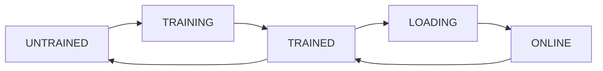

# NER API

## Requirements

To be able to run the project you'll need:

- [Pipenv](https://pipenv.readthedocs.io/en/latest/install/#installing-pipenv).
- [MongoDB](https://www.mongodb.com/)

## Getting started

```bash
pipenv install
pipenv run flask setup
```

## CLI

To access the command line interface run:

```bash
pipenv run flask shell
```

## Running the server

```bash
pipenv run flask run
```

## Versions state machine:

